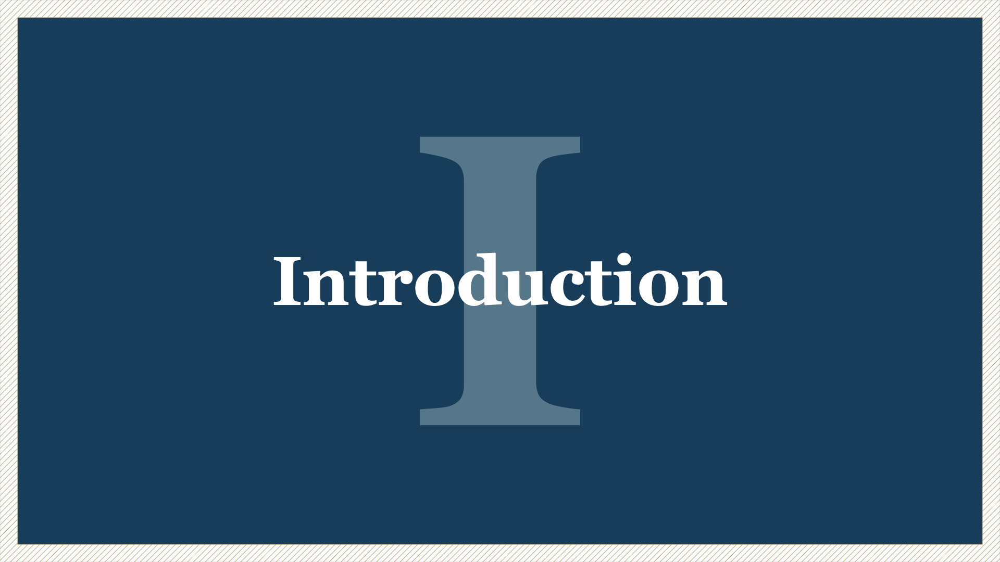
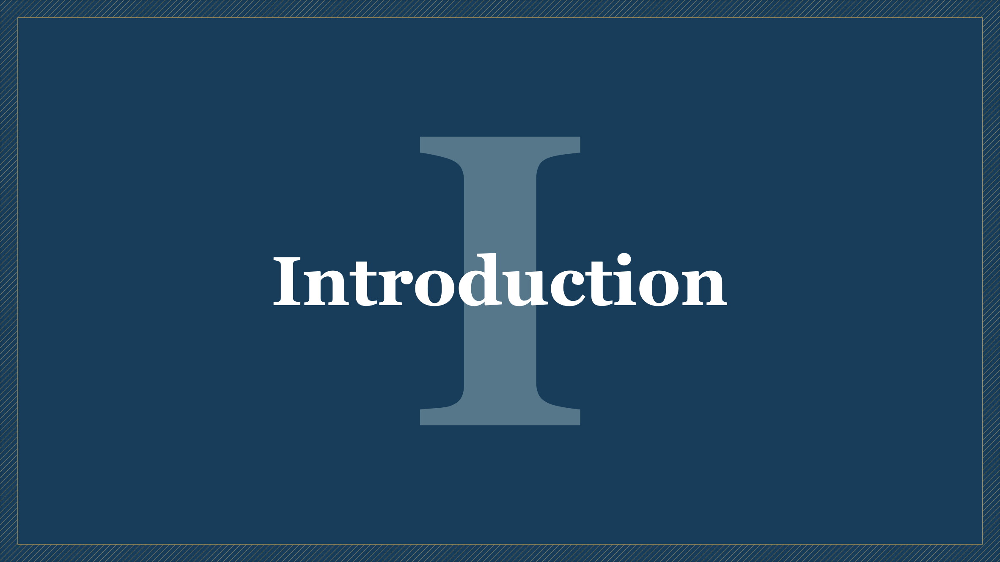
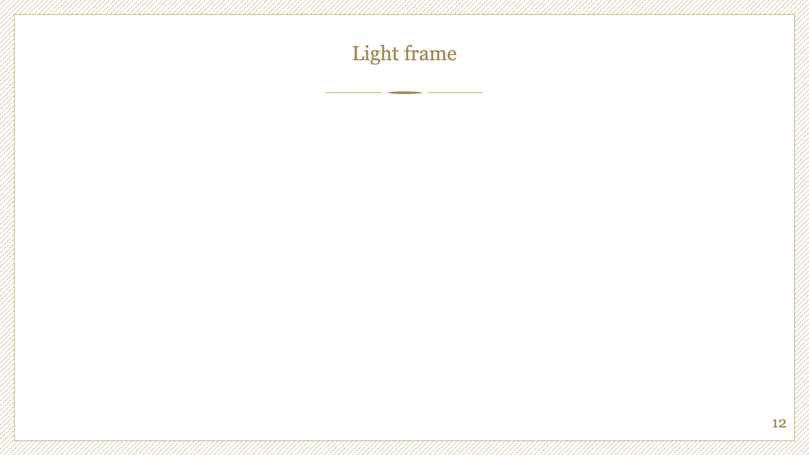
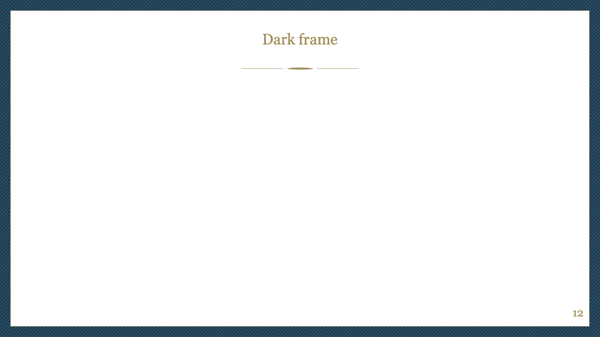

# Typst Polytechnique slide template

A Typst template for Polytechnique student oral presentations.

> [!warning]
> The original Polytechnique template uses the **Georgia font**. This is a copyrighted font, so it could not be included directly within the template. For better results, **you are encouraged to [download](https://font.download/font/georgia-2) it** and add it to the project (simply upload the font files on the web app). In case of issue, see [font management in Typst](https://typst.app/docs/reference/text/text#parameters-font).

## Settings overview

TODO

## Features

### Section titles

Section title slides come in four flavors: `light`, `light-dark`, `dark-light`, `dark`.

|                  `light`                  |                    `light-dark`                     |                    `dark-light`                     |                 `dark`                  |
| :---------------------------------------: | :-------------------------------------------------: | :-------------------------------------------------: | :-------------------------------------: |
|  |  |  |  |

### Frame themes

The fancy frame comes in two flavors: `light` or `dark`.

|                     `light`                     |                    `dark`                     |
| :---------------------------------------------: | :-------------------------------------------: |
|  |  |

### Color palette

The template exposes the color palette.

|                        `PALETTE.blue`                        |                        `PALETTE.gold`                        |                        `PALETTE.gray`                        |                        `PALETTE.lighter-blue`                        |
| :----------------------------------------------------------: | :----------------------------------------------------------: | :----------------------------------------------------------: | :------------------------------------------------------------------: |
|  |  |  |  |

## Todo

- [ ] thumbnail `slide-thumbnail.png`
- [ ] README
  - [ ] settings overview
  - [x] 4 themes h1
  - [x] 2 themes frame
  - [x] palettes
- [ ] fonts (Georgia, Century Gothic): think about it -> set default (careful size ! Merriweather? Linus Libertine?)
- [ ] cover
  - [ ] assets
  - [ ] different styles
- [x] outline
- [ ] template
  - [ ] options
  - [ ] typst demo
- [x] page
  - [x] allow for 4/3
  - [x] check spacing
  - [x] fancy stuff on the edges
  - [x] one slide on multiple pages
  - [x] numbering pages
- [x] headings
  - [x] think about numbering in for h1/h2
  - [x] h1
    - [x] weight? -> majority of bold
    - [x] move numbering to the bottom? or mid slide (current)? or mid text? -> mid text with roman numeral
  - [x] h2
    - [x] style
    - [x] assets
    - [x] check spacing
    - [x] weight? -> majority of regular
